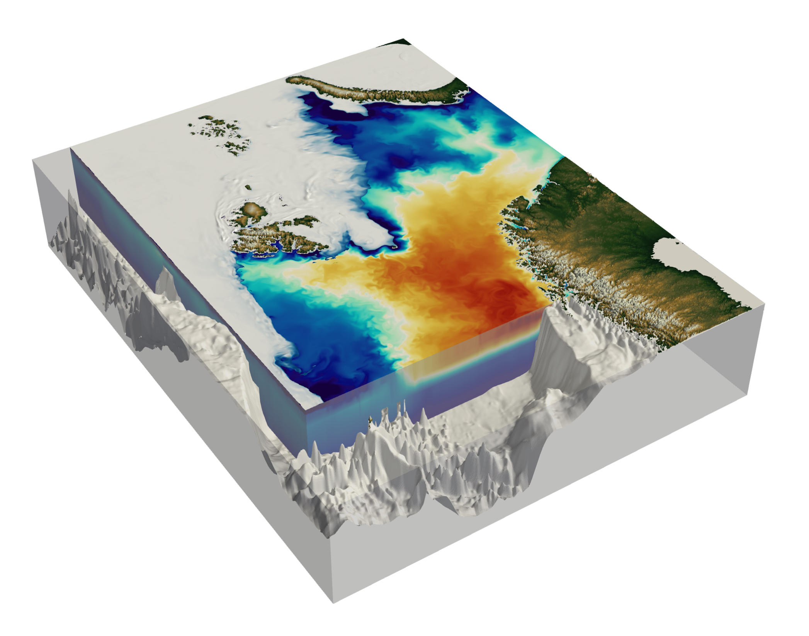
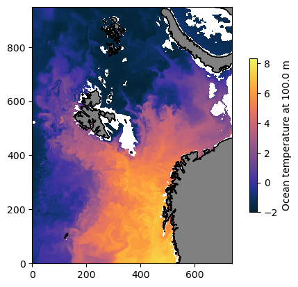

# Barents 2.5 ocean model

### About the product

[Barents-2.5](https://ocean.met.no/models#barents) is a ROMS-CICE (*METROMS*) model run by the Norwegian Meteorological institute.

[Röhrs et al (2023)](https://gmd.copernicus.org/articles/16/5401/2023/) describes the model. 

The model domain is centered on the Barents Sea including Svalbard, but extends to northern Scandinavia Novaya Zemlya in the east, the western Fram Strait and the central Eurasian basin. 




### About the data

#### Model

- 2.5 km spatial resolution and 42 ocean layers.
- 7 ice layers + 1 snow layer; 5 sea ice categories.
- Assimilates observed sea ice concentration, SST, and in-situ hydrography. 

Details of the model configuration are available [here](https://zenodo.org/records/7607191).
#### Forcing

- Ocean and sea ice boundary conditions from TOPAZ v4.
- Climatological runoff for Svalbard.
- River runoff data for mainland Norway from daily estimates from the Norwegian Water Resources and Energy Directorate.
  Atmospheric forcing from the Integrated Forecast System (IFS) at European Centre for Medium Weather Forecasts.


#### Access

- The files (v2.0) are opendap served here: https://thredds.met.no/thredds/fou-hi/barents_eps.html
- Daily files, but there is also an aggregated file (19381 time points..).
- Bunch of nice output variables: ``u, v, w, wind, St, T, SIC, SIT, ice_u, ice_v, zeta, mixing``
- Everything gridded to common **xyz grid** and available at **hourly resolution**.

#### Versions

- Version 1 covers 2020-06-11-> 2022-11-21.
- Version 2 covers 2022-06-29 to present (and a week or so into the future).

____

## Load the dataset

Lazy loading of aggregated, z-gridded data.


```python
import xarray as xr
import matplotlib.pyplot as plt
import cmocean
```


```python
url_b25_agg_v1 = 'https://thredds.met.no/thredds/dodsC/barents25km_agg' # V1.0 (2020-> 2022)
url_b25_agg_v2 = 'https://thredds.met.no/thredds/dodsC/fou-hi/barents_eps_zdepth_be' # V2.0 (2022->)
```


```python
ds_v1 = xr.open_dataset(url_b25_agg_v1)
ds_v2 = xr.open_dataset(url_b25_agg_v2)
```

____

### *Example:* Plot ocean temperature at 100 m depth

##### Choose a depth level we want to examine 


```python
depth_level = 100
```

##### Make subsets of the files with only this depth level


```python
ds_singledepth_v1 = ds_v1.sel(depth = depth_level, method = 'nearest')
ds_singledepth_v2 = ds_v2.sel(depth = depth_level, method = 'nearest')
```

**Plot ocean temperature** at `depth_level` (show the first time step of ds_v2)


```python
fig, ax = plt.subplots(); ax.set_aspect('equal')
C = ax.pcolormesh(ds_singledepth_v2.temperature.isel(time = 0), cmap = cmocean.cm.thermal)
ax.contourf(ds_v2.sea_mask, levels = [0, 0.5, 10], colors = ['gray', 'none'])
ax.contour(ds_v2.sea_mask, colors = ['k',], linewidths = 0.7)
plt.colorbar(C, shrink = 0.6,
             label = f'Ocean temperature at {float(ds_singledepth_v2.depth)} m')
```


    <matplotlib.colorbar.Colorbar at 0x7dfd4a2fe490>


    

    

