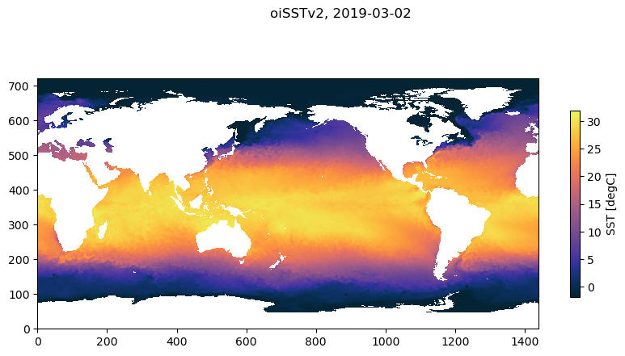

# NOAA OI SST V2 High Resolution Dataset

### About the product

NOAA High-resolution Blended Analysis of Daily SST and Ice.

Seems to be widely considered a high-quality product, and is often used.

Source: Multi-satellite sensor (AVHRR+VIIRS) data.

[Dataset description](https://www.ncei.noaa.gov/products/optimum-interpolation-sst)

[Data webpage](https://psl.noaa.gov/data/gridded/data.noaa.oisst.v2.highres.html)

Citation: https://doi.org/10.1175/JCLI-D-20-0166.1


### About the data

- Daily data.
- Time range: 1981 to near-present.
- 0.25° x 0.25° global coverage.
- Northern hemisphere grid (>50°N).

#### Access

- The files are opendap served at the NOAA Physical Sciences Laboratory: https://psl.noaa.gov/data/gridded/data.noaa.oisst.v2.highres.html
- Here, we load the daily mean SST. There are a bunch of other products: weekly and monthly means, anomalies, and period climatologies.
- Also has sea ice concentration

#### Versions

- Version 3.3 is the current one as of May 2024, and the one we load here.

____

## Load the dataset

Lazy loading of the oiSSTv2 data.


```python
import xarray as xr
import matplotlib.pyplot as plt
import cmocean
import numpy as np
```

### Load data from one single year


```python
url_oisst_v2 = ('http://www.psl.noaa.gov/thredds/dodsC/Datasets/'
 'noaa.oisst.v2.highres/sst.day.anom.2024.nc')
```


```python
ds = xr.open_dataset(url_oisst_v2)
```

___

### Load all data
Concatenating annual files with`open_mfdataset`


```python
all_annual_urls_oisst2_v2 = [
    (f'http://www.psl.noaa.gov/thredds/dodsC/Datasets/'
     f'noaa.oisst.v2.highres/sst.day.mean.{year}.nc')
    for year in np.arange(1981, 2025)]
```


```python
# Lazy loading the concatenated dataset (can take a few minutes)
ds_all = xr.open_mfdataset(all_annual_urls_oisst2_v2)
```

___

____

### *Example:* Plot SST temperature on a particular day

##### Choose a date


```python
date0 = '2019-03-02'
```

##### Make subsets of the files with only this date


```python
ds_day = ds_all.sel(time = date0, method = 'nearest').squeeze()
```

**Plot SST**


```python
fig, ax = plt.subplots(figsize = (10, 5))

ax.set_aspect('equal')


C = ax.pcolormesh(ds_day.sst, cmap = cmocean.cm.thermal)
cb = plt.colorbar(C, shrink = 0.6,
             label = 'SST [degC]')
fig.suptitle(f'oiSSTv2, {date0}')
```


    Text(0.5, 0.98, 'oiSSTv2, 2019-03-02')


    

    


```python
ds_day
```


<div><svg style="position: absolute; width: 0; height: 0; overflow: hidden">
<defs>
<symbol id="icon-database" viewBox="0 0 32 32">
<path d="M16 0c-8.837 0-16 2.239-16 5v4c0 2.761 7.163 5 16 5s16-2.239 16-5v-4c0-2.761-7.163-5-16-5z"></path>
<path d="M16 17c-8.837 0-16-2.239-16-5v6c0 2.761 7.163 5 16 5s16-2.239 16-5v-6c0 2.761-7.163 5-16 5z"></path>
<path d="M16 26c-8.837 0-16-2.239-16-5v6c0 2.761 7.163 5 16 5s16-2.239 16-5v-6c0 2.761-7.163 5-16 5z"></path>
</symbol>
<symbol id="icon-file-text2" viewBox="0 0 32 32">
<path d="M28.681 7.159c-0.694-0.947-1.662-2.053-2.724-3.116s-2.169-2.030-3.116-2.724c-1.612-1.182-2.393-1.319-2.841-1.319h-15.5c-1.378 0-2.5 1.121-2.5 2.5v27c0 1.378 1.122 2.5 2.5 2.5h23c1.378 0 2.5-1.122 2.5-2.5v-19.5c0-0.448-0.137-1.23-1.319-2.841zM24.543 5.457c0.959 0.959 1.712 1.825 2.268 2.543h-4.811v-4.811c0.718 0.556 1.584 1.309 2.543 2.268zM28 29.5c0 0.271-0.229 0.5-0.5 0.5h-23c-0.271 0-0.5-0.229-0.5-0.5v-27c0-0.271 0.229-0.5 0.5-0.5 0 0 15.499-0 15.5 0v7c0 0.552 0.448 1 1 1h7v19.5z"></path>
<path d="M23 26h-14c-0.552 0-1-0.448-1-1s0.448-1 1-1h14c0.552 0 1 0.448 1 1s-0.448 1-1 1z"></path>
<path d="M23 22h-14c-0.552 0-1-0.448-1-1s0.448-1 1-1h14c0.552 0 1 0.448 1 1s-0.448 1-1 1z"></path>
<path d="M23 18h-14c-0.552 0-1-0.448-1-1s0.448-1 1-1h14c0.552 0 1 0.448 1 1s-0.448 1-1 1z"></path>
</symbol>
</defs>
</svg>
<style>/* CSS stylesheet for displaying xarray objects in jupyterlab.
 *
 */

:root {
  --xr-font-color0: var(--jp-content-font-color0, rgba(0, 0, 0, 1));
  --xr-font-color2: var(--jp-content-font-color2, rgba(0, 0, 0, 0.54));
  --xr-font-color3: var(--jp-content-font-color3, rgba(0, 0, 0, 0.38));
  --xr-border-color: var(--jp-border-color2, #e0e0e0);
  --xr-disabled-color: var(--jp-layout-color3, #bdbdbd);
  --xr-background-color: var(--jp-layout-color0, white);
  --xr-background-color-row-even: var(--jp-layout-color1, white);
  --xr-background-color-row-odd: var(--jp-layout-color2, #eeeeee);
}

html[theme=dark],
body[data-theme=dark],
body.vscode-dark {
  --xr-font-color0: rgba(255, 255, 255, 1);
  --xr-font-color2: rgba(255, 255, 255, 0.54);
  --xr-font-color3: rgba(255, 255, 255, 0.38);
  --xr-border-color: #1F1F1F;
  --xr-disabled-color: #515151;
  --xr-background-color: #111111;
  --xr-background-color-row-even: #111111;
  --xr-background-color-row-odd: #313131;
}

.xr-wrap {
  display: block !important;
  min-width: 300px;
  max-width: 700px;
}

.xr-text-repr-fallback {
  /* fallback to plain text repr when CSS is not injected (untrusted notebook) */
  display: none;
}

.xr-header {
  padding-top: 6px;
  padding-bottom: 6px;
  margin-bottom: 4px;
  border-bottom: solid 1px var(--xr-border-color);
}

.xr-header > div,
.xr-header > ul {
  display: inline;
  margin-top: 0;
  margin-bottom: 0;
}

.xr-obj-type,
.xr-array-name {
  margin-left: 2px;
  margin-right: 10px;
}

.xr-obj-type {
  color: var(--xr-font-color2);
}

.xr-sections {
  padding-left: 0 !important;
  display: grid;
  grid-template-columns: 150px auto auto 1fr 20px 20px;
}

.xr-section-item {
  display: contents;
}

.xr-section-item input {
  display: none;
}

.xr-section-item input + label {
  color: var(--xr-disabled-color);
}

.xr-section-item input:enabled + label {
  cursor: pointer;
  color: var(--xr-font-color2);
}

.xr-section-item input:enabled + label:hover {
  color: var(--xr-font-color0);
}

.xr-section-summary {
  grid-column: 1;
  color: var(--xr-font-color2);
  font-weight: 500;
}

.xr-section-summary > span {
  display: inline-block;
  padding-left: 0.5em;
}

.xr-section-summary-in:disabled + label {
  color: var(--xr-font-color2);
}

.xr-section-summary-in + label:before {
  display: inline-block;
  content: '►';
  font-size: 11px;
  width: 15px;
  text-align: center;
}

.xr-section-summary-in:disabled + label:before {
  color: var(--xr-disabled-color);
}

.xr-section-summary-in:checked + label:before {
  content: '▼';
}

.xr-section-summary-in:checked + label > span {
  display: none;
}

.xr-section-summary,
.xr-section-inline-details {
  padding-top: 4px;
  padding-bottom: 4px;
}

.xr-section-inline-details {
  grid-column: 2 / -1;
}

.xr-section-details {
  display: none;
  grid-column: 1 / -1;
  margin-bottom: 5px;
}

.xr-section-summary-in:checked ~ .xr-section-details {
  display: contents;
}

.xr-array-wrap {
  grid-column: 1 / -1;
  display: grid;
  grid-template-columns: 20px auto;
}

.xr-array-wrap > label {
  grid-column: 1;
  vertical-align: top;
}

.xr-preview {
  color: var(--xr-font-color3);
}

.xr-array-preview,
.xr-array-data {
  padding: 0 5px !important;
  grid-column: 2;
}

.xr-array-data,
.xr-array-in:checked ~ .xr-array-preview {
  display: none;
}

.xr-array-in:checked ~ .xr-array-data,
.xr-array-preview {
  display: inline-block;
}

.xr-dim-list {
  display: inline-block !important;
  list-style: none;
  padding: 0 !important;
  margin: 0;
}

.xr-dim-list li {
  display: inline-block;
  padding: 0;
  margin: 0;
}

.xr-dim-list:before {
  content: '(';
}

.xr-dim-list:after {
  content: ')';
}

.xr-dim-list li:not(:last-child):after {
  content: ',';
  padding-right: 5px;
}

.xr-has-index {
  font-weight: bold;
}

.xr-var-list,
.xr-var-item {
  display: contents;
}

.xr-var-item > div,
.xr-var-item label,
.xr-var-item > .xr-var-name span {
  background-color: var(--xr-background-color-row-even);
  margin-bottom: 0;
}

.xr-var-item > .xr-var-name:hover span {
  padding-right: 5px;
}

.xr-var-list > li:nth-child(odd) > div,
.xr-var-list > li:nth-child(odd) > label,
.xr-var-list > li:nth-child(odd) > .xr-var-name span {
  background-color: var(--xr-background-color-row-odd);
}

.xr-var-name {
  grid-column: 1;
}

.xr-var-dims {
  grid-column: 2;
}

.xr-var-dtype {
  grid-column: 3;
  text-align: right;
  color: var(--xr-font-color2);
}

.xr-var-preview {
  grid-column: 4;
}

.xr-index-preview {
  grid-column: 2 / 5;
  color: var(--xr-font-color2);
}

.xr-var-name,
.xr-var-dims,
.xr-var-dtype,
.xr-preview,
.xr-attrs dt {
  white-space: nowrap;
  overflow: hidden;
  text-overflow: ellipsis;
  padding-right: 10px;
}

.xr-var-name:hover,
.xr-var-dims:hover,
.xr-var-dtype:hover,
.xr-attrs dt:hover {
  overflow: visible;
  width: auto;
  z-index: 1;
}

.xr-var-attrs,
.xr-var-data,
.xr-index-data {
  display: none;
  background-color: var(--xr-background-color) !important;
  padding-bottom: 5px !important;
}

.xr-var-attrs-in:checked ~ .xr-var-attrs,
.xr-var-data-in:checked ~ .xr-var-data,
.xr-index-data-in:checked ~ .xr-index-data {
  display: block;
}

.xr-var-data > table {
  float: right;
}

.xr-var-name span,
.xr-var-data,
.xr-index-name div,
.xr-index-data,
.xr-attrs {
  padding-left: 25px !important;
}

.xr-attrs,
.xr-var-attrs,
.xr-var-data,
.xr-index-data {
  grid-column: 1 / -1;
}

dl.xr-attrs {
  padding: 0;
  margin: 0;
  display: grid;
  grid-template-columns: 125px auto;
}

.xr-attrs dt,
.xr-attrs dd {
  padding: 0;
  margin: 0;
  float: left;
  padding-right: 10px;
  width: auto;
}

.xr-attrs dt {
  font-weight: normal;
  grid-column: 1;
}

.xr-attrs dt:hover span {
  display: inline-block;
  background: var(--xr-background-color);
  padding-right: 10px;
}

.xr-attrs dd {
  grid-column: 2;
  white-space: pre-wrap;
  word-break: break-all;
}

.xr-icon-database,
.xr-icon-file-text2,
.xr-no-icon {
  display: inline-block;
  vertical-align: middle;
  width: 1em;
  height: 1.5em !important;
  stroke-width: 0;
  stroke: currentColor;
  fill: currentColor;
}
</style><pre class='xr-text-repr-fallback'>&lt;xarray.Dataset&gt;
Dimensions:  (lon: 1440, lat: 720)
Coordinates:
    time     datetime64[ns] 2019-03-02
  * lon      (lon) float32 0.125 0.375 0.625 0.875 ... 359.1 359.4 359.6 359.9
  * lat      (lat) float32 -89.88 -89.62 -89.38 -89.12 ... 89.38 89.62 89.88
Data variables:
    sst      (lat, lon) float32 dask.array&lt;chunksize=(720, 1440), meta=np.ndarray&gt;
Attributes:
    Conventions:                     CF-1.5
    title:                           NOAA High-resolution Blended Analysis: D...
    institution:                     NOAA/NCDC
    source:                          NOAA/NCDC  ftp://eclipse.ncdc.noaa.gov/p...
    history:                         Thu Aug 24 13:34:17 2017: ncatted -O -a ...
    dataset_title:                   NOAA Daily Optimum Interpolation Sea Sur...
    References:                      https://www.psl.noaa.gov/data/gridded/da...
    _NCProperties:                   version=2,netcdf=4.6.3,hdf5=1.10.5
    comment:                         Reynolds, et al.(2007) Daily High-Resolu...
    DODS_EXTRA.Unlimited_Dimension:  time</pre><div class='xr-wrap' style='display:none'><div class='xr-header'><div class='xr-obj-type'>xarray.Dataset</div></div><ul class='xr-sections'><li class='xr-section-item'><input id='section-2fb4993d-b8ee-448a-9b63-c07205100076' class='xr-section-summary-in' type='checkbox' disabled ><label for='section-2fb4993d-b8ee-448a-9b63-c07205100076' class='xr-section-summary'  title='Expand/collapse section'>Dimensions:</label><div class='xr-section-inline-details'><ul class='xr-dim-list'><li><span class='xr-has-index'>lon</span>: 1440</li><li><span class='xr-has-index'>lat</span>: 720</li></ul></div><div class='xr-section-details'></div></li><li class='xr-section-item'><input id='section-4f891a89-9a7c-425a-8454-285545ce0f65' class='xr-section-summary-in' type='checkbox'  checked><label for='section-4f891a89-9a7c-425a-8454-285545ce0f65' class='xr-section-summary' >Coordinates: <span>(3)</span></label><div class='xr-section-inline-details'></div><div class='xr-section-details'><ul class='xr-var-list'><li class='xr-var-item'><div class='xr-var-name'><span>time</span></div><div class='xr-var-dims'>()</div><div class='xr-var-dtype'>datetime64[ns]</div><div class='xr-var-preview xr-preview'>2019-03-02</div><input id='attrs-4fd28bc5-26d1-4ea9-ab50-4ad99f7ef401' class='xr-var-attrs-in' type='checkbox' ><label for='attrs-4fd28bc5-26d1-4ea9-ab50-4ad99f7ef401' title='Show/Hide attributes'><svg class='icon xr-icon-file-text2'><use xlink:href='#icon-file-text2'></use></svg></label><input id='data-6088d48d-5b1a-4247-9117-4070dcd39ae9' class='xr-var-data-in' type='checkbox'><label for='data-6088d48d-5b1a-4247-9117-4070dcd39ae9' title='Show/Hide data repr'><svg class='icon xr-icon-database'><use xlink:href='#icon-database'></use></svg></label><div class='xr-var-attrs'><dl class='xr-attrs'><dt><span>long_name :</span></dt><dd>Time</dd><dt><span>delta_t :</span></dt><dd>0000-00-01 00:00:00</dd><dt><span>avg_period :</span></dt><dd>0000-00-01 00:00:00</dd><dt><span>axis :</span></dt><dd>T</dd><dt><span>actual_range :</span></dt><dd>[66352. 66473.]</dd><dt><span>_ChunkSizes :</span></dt><dd>1</dd></dl></div><div class='xr-var-data'><pre>array(&#x27;2019-03-02T00:00:00.000000000&#x27;, dtype=&#x27;datetime64[ns]&#x27;)</pre></div></li><li class='xr-var-item'><div class='xr-var-name'><span class='xr-has-index'>lon</span></div><div class='xr-var-dims'>(lon)</div><div class='xr-var-dtype'>float32</div><div class='xr-var-preview xr-preview'>0.125 0.375 0.625 ... 359.6 359.9</div><input id='attrs-167a2ca7-c5a2-4e00-92cf-357d4ee215e7' class='xr-var-attrs-in' type='checkbox' ><label for='attrs-167a2ca7-c5a2-4e00-92cf-357d4ee215e7' title='Show/Hide attributes'><svg class='icon xr-icon-file-text2'><use xlink:href='#icon-file-text2'></use></svg></label><input id='data-77024b1f-a32d-4612-bac8-f1059d530b32' class='xr-var-data-in' type='checkbox'><label for='data-77024b1f-a32d-4612-bac8-f1059d530b32' title='Show/Hide data repr'><svg class='icon xr-icon-database'><use xlink:href='#icon-database'></use></svg></label><div class='xr-var-attrs'><dl class='xr-attrs'><dt><span>axis :</span></dt><dd>X</dd><dt><span>long_name :</span></dt><dd>Longitude</dd><dt><span>standard_name :</span></dt><dd>longitude</dd><dt><span>units :</span></dt><dd>degrees_east</dd><dt><span>actual_range :</span></dt><dd>[1.25000e-01 3.59875e+02]</dd></dl></div><div class='xr-var-data'><pre>array([1.25000e-01, 3.75000e-01, 6.25000e-01, ..., 3.59375e+02, 3.59625e+02,
       3.59875e+02], dtype=float32)</pre></div></li><li class='xr-var-item'><div class='xr-var-name'><span class='xr-has-index'>lat</span></div><div class='xr-var-dims'>(lat)</div><div class='xr-var-dtype'>float32</div><div class='xr-var-preview xr-preview'>-89.88 -89.62 ... 89.62 89.88</div><input id='attrs-e1a5ce3b-8ccd-4a06-b6d9-24accd03e51b' class='xr-var-attrs-in' type='checkbox' ><label for='attrs-e1a5ce3b-8ccd-4a06-b6d9-24accd03e51b' title='Show/Hide attributes'><svg class='icon xr-icon-file-text2'><use xlink:href='#icon-file-text2'></use></svg></label><input id='data-75354432-6eec-48ac-b653-25d47ca72db9' class='xr-var-data-in' type='checkbox'><label for='data-75354432-6eec-48ac-b653-25d47ca72db9' title='Show/Hide data repr'><svg class='icon xr-icon-database'><use xlink:href='#icon-database'></use></svg></label><div class='xr-var-attrs'><dl class='xr-attrs'><dt><span>units :</span></dt><dd>degrees_north</dd><dt><span>actual_range :</span></dt><dd>[-89.875  89.875]</dd><dt><span>axis :</span></dt><dd>Y</dd><dt><span>standard_name :</span></dt><dd>latitude</dd><dt><span>long_name :</span></dt><dd>Latitude</dd></dl></div><div class='xr-var-data'><pre>array([-89.875, -89.625, -89.375, ...,  89.375,  89.625,  89.875],
      dtype=float32)</pre></div></li></ul></div></li><li class='xr-section-item'><input id='section-7a98b7a2-1d4b-47ff-a8ab-8bf8db87913f' class='xr-section-summary-in' type='checkbox'  checked><label for='section-7a98b7a2-1d4b-47ff-a8ab-8bf8db87913f' class='xr-section-summary' >Data variables: <span>(1)</span></label><div class='xr-section-inline-details'></div><div class='xr-section-details'><ul class='xr-var-list'><li class='xr-var-item'><div class='xr-var-name'><span>sst</span></div><div class='xr-var-dims'>(lat, lon)</div><div class='xr-var-dtype'>float32</div><div class='xr-var-preview xr-preview'>dask.array&lt;chunksize=(720, 1440), meta=np.ndarray&gt;</div><input id='attrs-518f83d8-9f55-4733-a41d-03249ad1b6ff' class='xr-var-attrs-in' type='checkbox' ><label for='attrs-518f83d8-9f55-4733-a41d-03249ad1b6ff' title='Show/Hide attributes'><svg class='icon xr-icon-file-text2'><use xlink:href='#icon-file-text2'></use></svg></label><input id='data-f92aef98-a7e5-439e-9582-f78c97814ff3' class='xr-var-data-in' type='checkbox'><label for='data-f92aef98-a7e5-439e-9582-f78c97814ff3' title='Show/Hide data repr'><svg class='icon xr-icon-database'><use xlink:href='#icon-database'></use></svg></label><div class='xr-var-attrs'><dl class='xr-attrs'><dt><span>long_name :</span></dt><dd>Daily Sea Surface Temperature</dd><dt><span>units :</span></dt><dd>degC</dd><dt><span>valid_range :</span></dt><dd>[-3. 45.]</dd><dt><span>precision :</span></dt><dd>2.0</dd><dt><span>dataset :</span></dt><dd>NOAA High-resolution Blended Analysis</dd><dt><span>var_desc :</span></dt><dd>Sea Surface Temperature</dd><dt><span>level_desc :</span></dt><dd>Surface</dd><dt><span>statistic :</span></dt><dd>Mean</dd><dt><span>parent_stat :</span></dt><dd>Individual Observations</dd><dt><span>actual_range :</span></dt><dd>[-1.8  34.82]</dd><dt><span>_ChunkSizes :</span></dt><dd>[   1  720 1440]</dd></dl></div><div class='xr-var-data'><table>
    <tr>
        <td>
            <table style="border-collapse: collapse;">
                <thead>
                    <tr>
                        <td> </td>
                        <th> Array </th>
                        <th> Chunk </th>
                    </tr>
                </thead>
                <tbody>

                    <tr>
                        <th> Bytes </th>
                        <td> 3.96 MiB </td>
                        <td> 3.96 MiB </td>
                    </tr>

                    <tr>
                        <th> Shape </th>
                        <td> (720, 1440) </td>
                        <td> (720, 1440) </td>
                    </tr>
                    <tr>
                        <th> Dask graph </th>
                        <td colspan="2"> 1 chunks in 90 graph layers </td>
                    </tr>
                    <tr>
                        <th> Data type </th>
                        <td colspan="2"> float32 numpy.ndarray </td>
                    </tr>
                </tbody>
            </table>
        </td>
        <td>
        <svg width="170" height="110" style="stroke:rgb(0,0,0);stroke-width:1" >

  <!-- Horizontal lines -->
  <line x1="0" y1="0" x2="120" y2="0" style="stroke-width:2" />
  <line x1="0" y1="60" x2="120" y2="60" style="stroke-width:2" />

  <!-- Vertical lines -->
  <line x1="0" y1="0" x2="0" y2="60" style="stroke-width:2" />
  <line x1="120" y1="0" x2="120" y2="60" style="stroke-width:2" />

  <!-- Colored Rectangle -->
  <polygon points="0.0,0.0 120.0,0.0 120.0,60.0 0.0,60.0" style="fill:#ECB172A0;stroke-width:0"/>

  <!-- Text -->
  <text x="60.000000" y="80.000000" font-size="1.0rem" font-weight="100" text-anchor="middle" >1440</text>
  <text x="140.000000" y="30.000000" font-size="1.0rem" font-weight="100" text-anchor="middle" transform="rotate(-90,140.000000,30.000000)">720</text>
</svg>
        </td>
    </tr>
</table></div></li></ul></div></li><li class='xr-section-item'><input id='section-1668f340-0411-44a0-9890-0e6c846c26cb' class='xr-section-summary-in' type='checkbox'  ><label for='section-1668f340-0411-44a0-9890-0e6c846c26cb' class='xr-section-summary' >Indexes: <span>(2)</span></label><div class='xr-section-inline-details'></div><div class='xr-section-details'><ul class='xr-var-list'><li class='xr-var-item'><div class='xr-index-name'><div>lon</div></div><div class='xr-index-preview'>PandasIndex</div><div></div><input id='index-d2b30152-a56f-412d-b261-0aa1054db37a' class='xr-index-data-in' type='checkbox'/><label for='index-d2b30152-a56f-412d-b261-0aa1054db37a' title='Show/Hide index repr'><svg class='icon xr-icon-database'><use xlink:href='#icon-database'></use></svg></label><div class='xr-index-data'><pre>PandasIndex(Index([  0.125,   0.375,   0.625,   0.875,   1.125,   1.375,   1.625,   1.875,
         2.125,   2.375,
       ...
       357.625, 357.875, 358.125, 358.375, 358.625, 358.875, 359.125, 359.375,
       359.625, 359.875],
      dtype=&#x27;float32&#x27;, name=&#x27;lon&#x27;, length=1440))</pre></div></li><li class='xr-var-item'><div class='xr-index-name'><div>lat</div></div><div class='xr-index-preview'>PandasIndex</div><div></div><input id='index-cc503d2e-1c4d-4788-a3ef-f06d615c1d50' class='xr-index-data-in' type='checkbox'/><label for='index-cc503d2e-1c4d-4788-a3ef-f06d615c1d50' title='Show/Hide index repr'><svg class='icon xr-icon-database'><use xlink:href='#icon-database'></use></svg></label><div class='xr-index-data'><pre>PandasIndex(Index([-89.875, -89.625, -89.375, -89.125, -88.875, -88.625, -88.375, -88.125,
       -87.875, -87.625,
       ...
        87.625,  87.875,  88.125,  88.375,  88.625,  88.875,  89.125,  89.375,
        89.625,  89.875],
      dtype=&#x27;float32&#x27;, name=&#x27;lat&#x27;, length=720))</pre></div></li></ul></div></li><li class='xr-section-item'><input id='section-bd8a03f0-bfc3-4f1f-a64a-c512c7cc9924' class='xr-section-summary-in' type='checkbox'  ><label for='section-bd8a03f0-bfc3-4f1f-a64a-c512c7cc9924' class='xr-section-summary' >Attributes: <span>(10)</span></label><div class='xr-section-inline-details'></div><div class='xr-section-details'><dl class='xr-attrs'><dt><span>Conventions :</span></dt><dd>CF-1.5</dd><dt><span>title :</span></dt><dd>NOAA High-resolution Blended Analysis: Daily Values using AVHRR only</dd><dt><span>institution :</span></dt><dd>NOAA/NCDC</dd><dt><span>source :</span></dt><dd>NOAA/NCDC  ftp://eclipse.ncdc.noaa.gov/pub/OI-daily-v2/</dd><dt><span>history :</span></dt><dd>Thu Aug 24 13:34:17 2017: ncatted -O -a References,global,d,, sst.day.mean.1981.v2.nc
Version 1.0</dd><dt><span>dataset_title :</span></dt><dd>NOAA Daily Optimum Interpolation Sea Surface Temperature</dd><dt><span>References :</span></dt><dd>https://www.psl.noaa.gov/data/gridded/data.noaa.oisst.v2.highres.html</dd><dt><span>_NCProperties :</span></dt><dd>version=2,netcdf=4.6.3,hdf5=1.10.5</dd><dt><span>comment :</span></dt><dd>Reynolds, et al.(2007) Daily High-Resolution-Blended Analyses for Sea Surface Temperature (available at https://doi.org/10.1175/2007JCLI1824.1). Banzon, et al.(2016) A long-term record of blended satellite and in situ sea-surface temperature for climate monitoring, modeling and environmental studies (available at https://doi.org/10.5194/essd-8-165-2016). Huang, B., C. Liu, V. Banzon, E. Freeman, G. Graham, B. Hankins, T. Smith, and H.-M. Zhang, 2021: Improvements of the Daily Optimum Interpolation Sea Surface Temperature (DOISST) Version 2.1 (available at https://doi.org/10.1175/JCLI-D-20-0166.1). Anomaly is based on 1971-2000 OI.v2 SST. Satellite data: multi-satellite sensor (AVHRR+VIIRS) data. Ice data: NCEP Ice and GSFC Ice. Data less than 15 days old may be subject to revision.</dd><dt><span>DODS_EXTRA.Unlimited_Dimension :</span></dt><dd>time</dd></dl></div></li></ul></div></div>


```python

```
